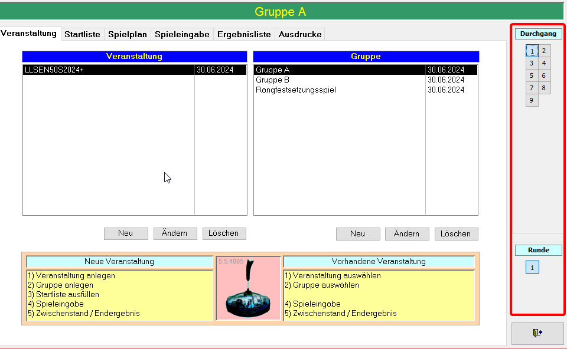
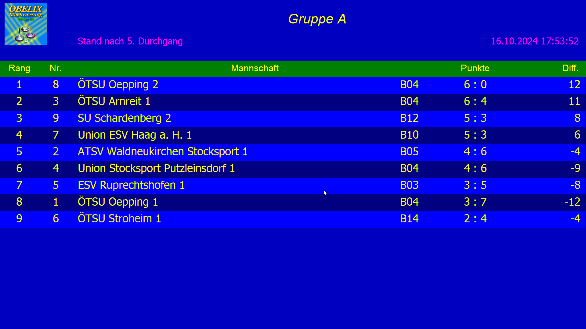

## Installation
---
Die Installation von Obelix Stockwertung erfordert die Microsoft Access 2013/2016/2019/2021 32 Bit Runtime, wobei nur ab 2019 offiziell erhältlich ist. Zur Installation von der Microsoft Access Runtime müssen alle 64Bit Office Programme deinstalliert werden. Sonst ist die Installation einfach, jedoch ist nur eine "Probeversion" erhältlich. Es besteht keine Möglichkeit auf der Webseite die Software zu kaufen. Bei start der Software wird man erinnert, dass die Probeversion abgelaufen ist, jedoch hat dies keine Konsequenzen.
## Veranstaltung
---
In der Veranstaltungsansicht werden Veranstaltungen erstellt welche mehrere Gruppen beinhalten.

Veranstaltung benötigen Namen, Ort, Datum und einen Veranstalter.

### Gruppen

Gruppen benötigen einen Namen, ein Startgeld, einen Bewerbstypen, je nach Bewerbstypen einen Modus und eine Anzahl an Runden 

Nach Auswahl einer Gruppe, wählt man den Durchgang/Runde und wechselt auf die Startliste

## Startliste
---
In der Startliste werden die Mannschaftsnamen und Spieler eingetragen. Es gibt keine Namenskonventionen. Startnummern werden automatisch vergeben. Teams werden in dieser Ansicht auch als nicht anwesend oder disqualifiziert eingetragen. 

## Spielplan
---
Der Spielplan generiert eine Tabelle, welche für jeden Durchgang alle Teams gerecht aufteilt.

## Spieleingabe
---
In dieser Ansicht werden die Summen und Strafpunkte der jeweiligen Duelle vom Benutzer eingegeben. Dies passiert bei jedem Durchgang. Die Zuteilung zu den Bahnen passiert Automatisch. Teams welche als nicht anwesend/disqualifiziert markiert sind werden trotzdem für matches generiert, jedoch ist es nicht möglich Werte für diese einzutragen.

## Ergebnisliste
---
Diese Ansicht zeigt den derzeitigen Stand nach dem aktuellen Durchgang. Runden und Durchgänge sind frei wählbar, und haben keine Relevanz für die Punktezählung. 

## Ausdrucke
---
Diese Ansicht dient allen möglichen graphischen Darstellungen der Ergebnisse/Spieler, welche bei dieser Gruppe eingetragen sind. Links sind alle möglichen Dokumente, Urkunden und Listen zum Exportieren möglich. Dieser Export kann entweder als Pop-Up Fenster erscheinen, gedruckt werden oder als Datei geliefert werden. Bei manchen Ausgaben stürtzt das Programm ab.  

### Bildschirm Export der Endergebnisliste

Auf der Präsentationsseite des Ausdrucksfensters kann man alle möglichen relevanten Daten im Fullscreen Modus anzeigen. Es gibt keine Tastenkombination außer **ALT+F4**, welche diese Ansicht schließen konnte.
